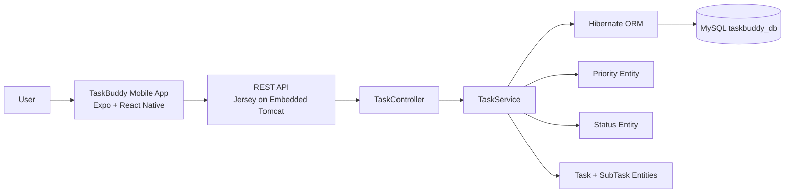
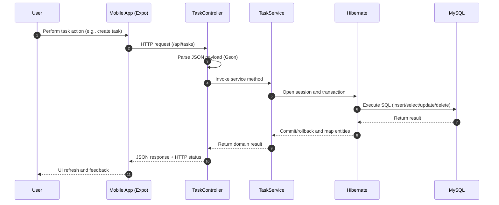
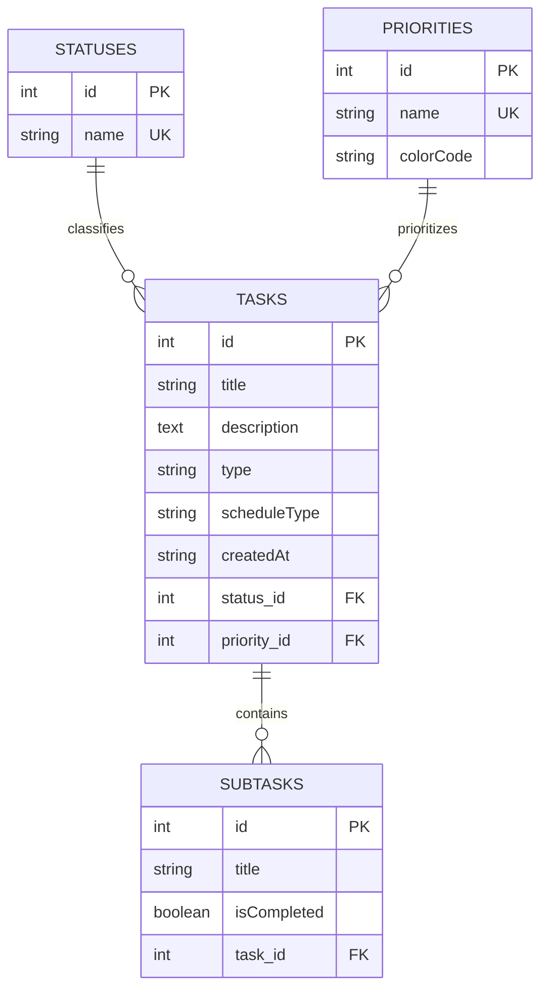

# TaskBuddy

## Project Overview
TaskBuddy is a task-tracking platform designed to help individuals and teams organize work, monitor progress, and complete priorities on time. The project combines a mobile-first user experience with a REST-based backend API and persistent storage.

For non-technical stakeholders, the primary purpose is straightforward: users can create tasks, group them by category, assign priority and status, break work into subtasks, and track completion through a simple interface. For developers, TaskBuddy provides a clear full-stack architecture with an Expo React Native client, a Java REST API, and a Hibernate/MySQL data layer.

## Features
- Task creation with title, description, category, schedule, priority, and status
- Subtask checklist support for breaking larger tasks into manageable steps
- Task listing with filtering by status, category, and priority
- Task detail view with progress tracking based on subtask completion
- Task completion and status toggling directly from the detail screen
- Task deletion from the task list
- Onboarding flow for first-time users with local profile preferences
- Theme switching (light/dark mode) with persisted user preference
- Cross-platform client behavior for Android, iOS, and web through Expo
- CORS-enabled REST API for client-server integration

## Technology Stack

### Frontend (Mobile Client)
- TypeScript
- React 19
- React Native 0.81
- Expo SDK 54
- Expo Router (file-based navigation)
- AsyncStorage (local persistence for theme and onboarding data)
- React Navigation (navigation primitives used by Expo Router)
- Axios and Fetch API (HTTP communication)
- Ionicons via @expo/vector-icons

### Backend (API)
- Java 20
- Apache Tomcat Embedded 11
- Jersey (Jakarta RESTful Web Services)
- Hibernate ORM 5.6
- Gson (JSON serialization and parsing)
- HK2 (Jersey dependency injection support)

### Database
- MySQL 8
- Hibernate auto schema update (`hbm2ddl.auto=update`)

### Build and Tooling
- Maven (Java dependency and build management)
- npm (JavaScript/TypeScript dependency and script management)
- ESLint (frontend linting)

## System Architecture
TaskBuddy follows a layered client-server design:
- Presentation layer: Expo React Native screens handle user interaction
- API layer: Jersey controllers expose REST endpoints under `/api/*`
- Service layer: business logic and transaction handling in `TaskService`
- Persistence layer: Hibernate entities and MySQL storage



## Request Lifecycle
The lifecycle below represents a typical task operation (create/read/update/delete):



## API Example

The API runs at `http://localhost:8080/api`. Create a task with `POST /tasks`:

```bash
curl -X POST http://localhost:8080/api/tasks \
   -H "Content-Type: application/json" \
   -d '{
      "title": "Prepare weekly report",
      "description": "Summarize this week\u0027s completed work",
      "priorityId": 2,
      "type": "Work",
      "scheduleType": "Today",
      "statusId": 1,
      "createdAt": "2026-09-21T09:00:00.000Z",
      "subTasks": []
   }'
```

Successful response (`200 OK`):

```json
{"status":"Saved"}
```

## Database Design
The data model centers on tasks and their relationships to status, priority, and subtasks.



## Project Structure
The repository contains both mobile and backend components in one project workspace.

```text
TaskBuddy/
├─ app/                        # Expo Router screens (UI and navigation)
│  ├─ index.tsx                # Dashboard/home screen
│  ├─ addNewTask.tsx           # Task creation flow
│  ├─ allTasks.tsx             # Task list and filters
│  ├─ taskDetails.tsx          # Task detail and progress updates
│  ├─ firstTimePage.tsx        # First-time onboarding
│  └─ context/Theme.tsx        # Theme and user preference context
├─ app-example/                # Expo starter example code kept for reference
├─ assets/                     # Images and static app assets
├─ src/main/java/lk/jiat/
│  ├─ Main.java                # Embedded Tomcat bootstrap
│  ├─ config/                  # Jersey app config and CORS filter
│  ├─ controller/              # REST controllers (`/tasks` endpoints)
│  ├─ service/                 # Business logic and transaction handling
│  ├─ entity/                  # Hibernate entities (Task, SubTask, Status, Priority)
│  └─ util/                    # Hibernate session factory utility
├─ src/main/resources/
│  └─ hibernate.cfg.xml        # Database and ORM configuration
├─ src/test/java/              # Backend test source directory
├─ pom.xml                     # Maven backend configuration
├─ package.json                # Frontend dependencies and scripts
└─ README.md                   # Project documentation
```
